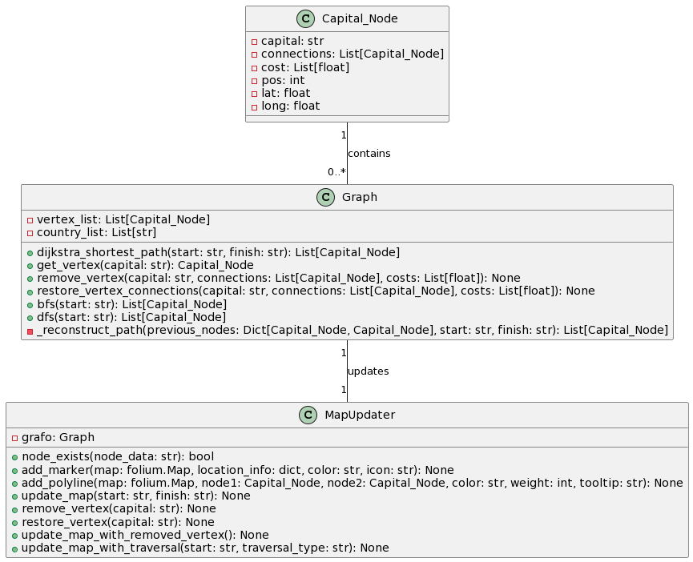

# Vuelos Capitales Europeas (Euroroutes)


## Integrantes
- Kenny Zhu
- Juan Aragon
- Tomas Cervera

## Informacion
### Euroroutes
Este es un aplicativo web que permita a un usuario saber las distintas rutas de vuelos a los capitales 
del continente europeo, donde dada una distribución de vuelos (al menos lugar de inicio y de destino), 
y la distancia que hay entre ellos encontrar el camino de menor costo (distancia entre ellos) para 
que el usuario pueda llegar:
- A todos los lugares desde un punto inicial.
- A un destino en específico.

## Contenido
- Carpeta data: Aqui se encuentra los datos del programa es decir los csv de los capitales, aeropuertos, etc, encontrados por las referencias en internet, y tiene una implementacion de como se creo el csv que se utlizo en el archivo data.ipynb
- Carpeta src: En esta carpeta se encontrara toda la implementacion del software, Back-end y Front-end, como las clases, los metodos, los html, el codigo para correr el programa, etc.
- Carpeta uml: Implementacion del diagrama UML

## Funcionalidad
este software el cliente puede:
- seleccionar una ciudad origen y destino de los capitales del continente europeo
- seleccionar una ciudad origen y a todos los ciudades destinos de los capitales del continente europeo
- ver el camino de menor costo entre la ciudad origen y destino
- eliminar y recuperar un vertice (capitales europeos).

## Diagrama UML


## Como ejecutar
1. En el repositorio, presionar en la parte de code, para copiar el HTTPS.
2. Tener python instalado.
3. Ingresar a cualquier IDE como vscode y clonar el repositorio con:
```
git clone https://github.com/K3nnyZY/Data_Strucutures_Lab2.git
```
4. Instalar las librerias utilizadas:
```
pip3 install pandas
pip3 install flask
pip3 install folium
```
5. Ejecutar el codigo.

## Referencias
- https://openflights.org/data.html#route
- https://docs.google.com/spreadsheets/d/1eepIWOHicQsLyZsb0mSXGPTXDp3vlql-aGuy1AWJED0/htmlview#
- https://github.com/alv2017/DataSets/blob/master/Europe/europe-capital-cities.csv
- https://python-visualization.github.io/folium/
- https://chat.openai.com/chat
- https://python-visualization.github.io/folium/flask.html
